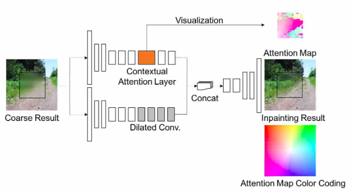

# Generative Image Inpainting with Contextual Attention

## Contents

* [Paper](Paper.pdf)

## Summary 

Recent Deep Learning based methods can generate visually plausible image structures and textures but often create distorted structures or blurry textures inconsistent with the surrounding areas.

Image Inpainting or completion is the process of filling missing pixels of an image. The core challenge of image impainting lies in synthesizing visually realistic and semantically plausible pixels for the missing regions.

Image inpainting is formulated as a conditional image generation problem where high-level recognition and low-level pixel synthesis are formulated into a convolutional encoded-decoded network jointly trained with adversarial networks. 

### Approach

A unified feed-forward generative network with a novel contextual attention layer for image impainting. The network consists of two stages.

* The first stage is a simple dilated convolutional network trained with reconstruction loss to rough out the missing contents.

* The second stage is to integrate contextual attention to use the features of known patches as convolutional filters to process the generated patches. The contextual attention module also has spatial propogation layer to encourage spatial coherency. In orger to allow the network to hallucinate novel contents, another convolutional pathway is constructed in parallel with the attention pathway. The two pathways are aggregated and fed into a single decoded to obtain the final output.

The whole network is trained end to end with reconstruction losses and two GAN losses.

## Architecture

### Improved Generative Inpainting Network

A baseline generative image inpainting network by reproducing and improving state-of-the-art inpainting models.

#### Coarse-To-Fine Network

The generator network takes an image with white pixels filled in the holes and a binary mask indicating the hole regions as input pairs and outputs the final completec image. The inouut is paired with corresponding binary mask to handle holes with variable sizes, shapes and locations.

The input to the network is a 256x256 image with rectangle missing region sampled randomly during training.

In image impainting tasks, the size of receptive fields should be sufficiently large. To further enlarge the receptive fields and stabilize training, two stage coarse-to-fine network architecture is used, where,

* The first network makes an initial coarse prediction,
* The second network takes the coarse prediction as input and predicts the refined results. 

The coarse network is trained with reconstruction as well as GAN losses.

#### Global and Local Wasserstein GANs

A modified version of WGAN-GP where the GAN loss is attached to both global and local outputs of the second-stage refinement network.

For image impainting, the gradient penalty should be applied only to pixels inside the holes. This is achieved by using a mask **m**.

, where the gradient  and  where  and  is the input to the generator.

Intuitively, the pixel-wise reconstruction loss directly regresses holes to the current ground truth image, while WGANs implicitly learn to math potentially correct images and train the generator with adversarial gradients.

#### Spacially Discounted Reconstruction Loss

Intuitively, missing pixels near the hole boundaries have much less ambiguity than those pixels closer to the center of the hole. A spatially discounted reconstruction loss is implemented using a weight mask **M** . The weight of each pixel in the mask is computed as  where l is the distance of the pizel to the nearest known pixel and  is set to 0.99 in all experiments.

The discounted loss is more effective for improving the visual quality for larger holes.

### Image Inpainting with Contextual Attention

CNNs process image features with local convolutional kernel layer by layer are not effective for borrowing features from distant spatial locations. 

To overcome this, a attention mechanism is introduced in the deep generative layer.

#### Contextual Attention

The contextual attention layer learns where to copy feature information from known background patches to generate missing patches. 

##### Match and Attend 

The problem where the features of missing pixels are to be matched with that of the surroundings (background). 

Patches are extracted in the background and then reshaped as convolutional filters. To match the foreground patches  with the background ones , the normalized inner product  is calculated where  represents the similarity of the patch centered in the background and the foreground. Then the similarity is weighed using a scalled softmax to get attention score for each pixel . The extracted patches  are reused as de-convolutional filers to reconstruct foreground.

##### Attention Propogation

The coherency of attention (shift in foreground patch is likely to correspond to an equal shift in the background patch) is further increased by propogation.

To model and encourage coherency of attention maps, a left-right propogation is followed by a top-down propogation with a kernel of size k to get the new score.

Attention propogation significantly improves inpainting results and enriches gradients.

#### Unified Inpainting Network

A two parallel encoder is introduced to integrate the attention module. The first encoder specifically focuses on hallucinating contents with layer-by-layer (dilated) convolution, while the second encoder tries to attend on the background features of interest. Output features from two encoders are aggregated and fed into a single decoder to obtain the final output.

#### Process

Given a raw image **x** a binary mask **m** is sampled at a random location. Input image z is corrupted from the raw image as . Inpainting network  takes concatenation of **z** and **m** as input and output predicted image  with the same size as input. Pasting the masked region of  to the input image, the inpainting output .

## Implementation

* [Original Implementation](https://github.com/JiahuiYu/generative_inpainting)

* [Pytorch Implementation](https://github.com/DAA233/generative-inpainting-pytorch)